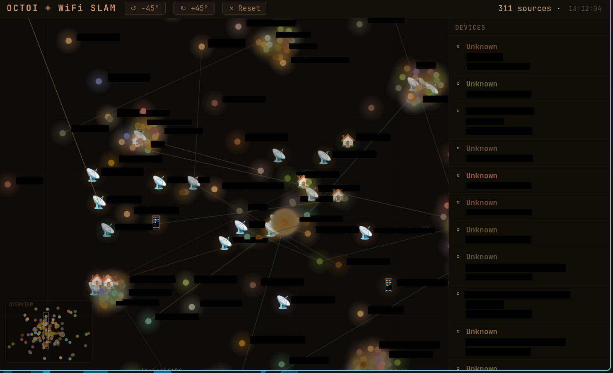
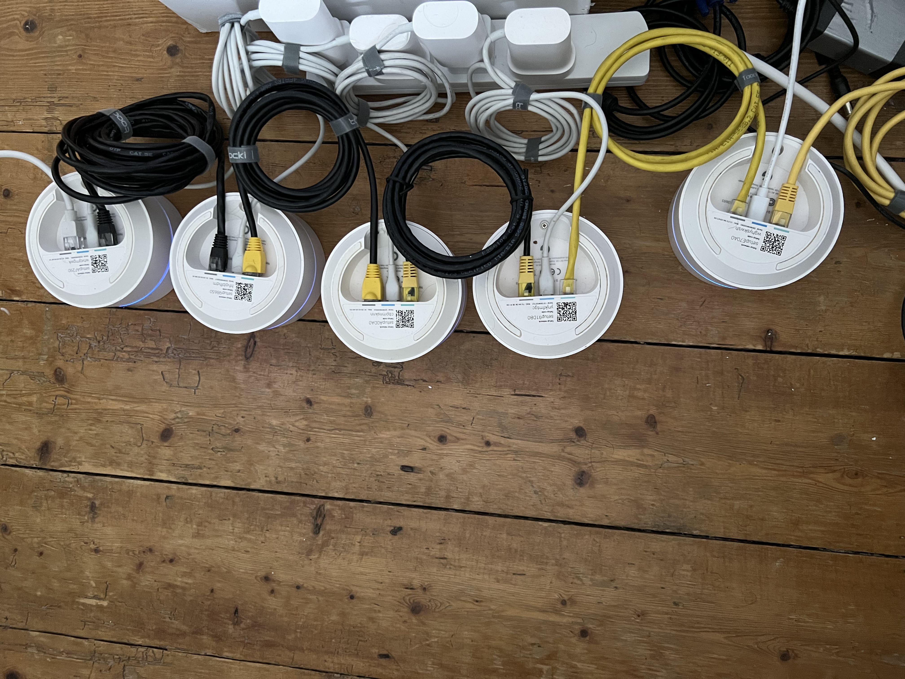

# Octoi - WiFi SLAM

---
The name was born out of octopus having arms of suckers 🐙

### Motivations

I've always thought about a WiFi radar project, because if we could
hear the broadcasts, it would sound like birds chirping. With OpenWRT,
it becomes trivially easy to think that connecting devices together,
measuring RSSI and time-of-arrival (ToA) across a fleet was it. 

### Dependancies
- Linux host with:
    - ufw
    - dnsmasq
    - nftables
    - ethernet port/dongle

- OpenWRT routers (>1, AC1304 on v24.10 tested)
    - kmod-veth
    - kmod-ptp
    - ip-full
    - linuxptp
    - resize2fs
    - gparted
    - ath10k-firmware-qca4019-ct-full-htt (remove current driver)

### Set-Up

A host is connected, running `/src/main.sh` which requires python for
    the UI. This host needs to:
    - The following is just a suggestion of how to use an ethernet
        port, your set up may be different but please observe
        3 **hard** requirements:
        1. Be a DHCP server (the code depends on finding dns leases
            from the host).
        2. Allow dns masquerading and a connection to a network
            access link (through wifi).
        3. Set that port to 192.168.1.2/24 (so you can always have
            access to the default webUI).

#### My setup was

1. Be a DHCP server using **nftables**
    - Set up /etc/dnsmasq.conf for the dongle/port to be
        dhcp-option=3,192.168.1.2 and all other settings for DHCP
        serving out that port.
    - Set up /etc/nftables.conf to allow access via ports
        53 (UDP/TCP) and 67 (UDP)
2. Allow device masquerading for internet access with **dnsmasq**
    and **nftables**
    - Set up /etc/nftables.conf to allow IPv4 forwarding
3. Allow traffic by allowing it through ufw
    - Set up /etc/ufw/before.rules to allow traffic from 
        dongle/port between wlan card

#### Routers are:
1. Flashed with OpenWRT (I chose 7 AC1304* units.)
2. (System -> Startup) Disable and stop firewall (not in use as
    network equipment)
3. (Network -> Interfaces -> LAN -> Edit ->  DHCP Server) Set LAN's
    DHCP to 'ignore interface' ✅
4. Bridge both LAN and WAN in br-lan.
5. Put the script `src/custom_ptp` in /etc/init.d/ each device and
    then, `chmod +x` it, `enable` and `start` it.
6. Reboot. All connected devices will ask for IPv4 addresses and
    have ptp4l clocks running.

*The AC1304 requires storage resizing after flashing.
[Full instructions here](https://openwrt.org/toh/google/wifi).
    I chose to do it with **gparted** and **resize2fs**.
    You can find scripts in /scripts to help with flashing and
        resizing but the sequence is:
        1. Flash the restore image (just hold reset button)
        2. Boot the OpenWRT image (hold reset, press 'dev switch'
            twice')
        3. Powercycle, connecting to LAN, (ping 192.168.1.1 until
            you find it)
        4. Run `flashing_scripts/000_update.sh`
        5. Run `flashing_scripts/001_tablefix.sh`
        6. Run `flashing_scripts/002_sizefix.sh`
            
### Usage 

Run `src/main.sh`. It will deploy the pucks.uc to all devices and
now, all devices are sequentially running through their widest
WiFi bands for all their radio on all spectra.

The script also auto-launches your host to hoover the data from
device-to-device. The exact sequencing will change but it works
for now.

WebUI doesn't autolaunch a browser for now, or probably ever. 
Multi-browser environments exist and are common so navigate to
[http://localhost:8201](http://localhost:8201)

Each device is running pucks.uc in /tmp, which gets wiped on
reboot. That means each device is filling a ring buffer. On
top of that, they try to maintain synced clock through ptp4l.

### Remarks

#### Used Claude code for the first time. It did unexpected things:

- Most efficient use: I just asked Claude to log into a device and
    bruteforce all testing in ucode namespace when stuck.

- Best highlight: The Candela-Tech driver has multiple antenna
    readings. When specifically pointed to figure out what each
    RSSI meant. Claude could search on device environment
    (/sys/, /proc/, modinfo) to find out exactly for me quickly.
    Turns out that the driver has antenna readings regardless of
    device capability so the last 2 readings are padding.

- Token saver: One minitask at a time. Thinking off. Deploying tests
    only when seeing circular progress.

- Worst use: Claude struggles with concise code for this task.
    It struggles with modularity. Probably hates the gang-of-four.

Overall, agentic has a buy-in of prior knowledge where quality
    matters. Where volume matters, you can just spray-and-pray.

#### Used ucode, another first.

- ucode is a
    [little language](https://craftinginterpreters.com/index.html)
    so there's not much training data. At some point, it
    decided the kernel namespace and ucode's namespace is
    exactly the same. Oh dear. 
- ucode seems to be made by one guy with easy
    [documentation](ucode.mein.io). It's quick to read but
    difficult when you realise it can be extremely strict on 
    syntax. Getting filtered queries from nl80211 was a painful.

#### Results themselves:

- Currently the results are not great. It's quite terrible and
    although the data can be refined to handle only a z-score,
    this is much different to what I expected from the literature.

- I am testing out different algorithms to get it to be more
    accurate, hopefully.

- Some of the jitter in results have been taken out, but I need
    another vectorised operation that runs on old-gen cpus which
    can quickly parse all of the data.

- Although the devices run ptp4l in (-P)eer mode, they don't have 
    hardware support for clock sync. 

- Cars are not tagged with the correct icon, so they appear as
    wrong/uknown manufacturer points. At some point, moving to
    rasterized glyphs would be best.

#### Failure points:

- Using IPv6 across one broadcast domain. Multiple tests pointed 
    to this being due to OpenWRT requiring manually set IPv6
    addresses or prefixes. On top of which, the ethernet comms
    would waste a millibit of extra time per each transfer, which
    scales to minutes and hours lost for data collection.

    The dream scenario would be to use IPv6 for its SLAAC and NA
    advantages, but you can't avoid the fact that the physical
    packets on the wire are just longer, which matters when 
    time sensitivity clock sync is also fighting data xfer.

- Ansible and Terraform. I probably need more time with those
    tools but they made the debug-loop extremely slow. Sticking
    with pure catting into ssh has been just nice.

- Due to the amount of experimentation in this, refactoring was 
    less of a priority than getting something to work. This is 
    not going to be a failure point for long as it needs to be 
    maintainable.

- The devices converge to hotspots. So the better testing in a 
    hanger sized faraday cage would be really needed, away from
    any vehicles or portable network access links. Using a 
    wardriving database or even Apple/Google location services
    might be a good direction for data correctness.

- Gemini tried to mislead me to often that I had to adjust its 
    memory. Using LLMs where there is little prior training data
    seems like a good idea but I have to research each part first.

### Final note

Using any part of this project for harm is explicitly and strictly
against the terms and conditions. The author bares no risk and 
accepts no one to the equipment and usage of that equipment by
others. You risk your own devices and this is purely a record of 
education and experimentation - at no point is the harm, distress
or removal of rights endorsed by the author. Check your local laws.

